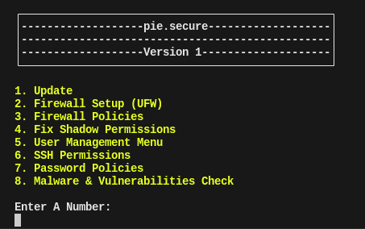

# pie.secure

**Version:** 1.0

**Author:** Mitchell "pie." Meister

## Description

`pie.secure` is a Bash script designed to help secure your Ubuntu-based Linux system. It automates various security-related tasks, making it easier for users to enhance the security of their systems.

## Features

- **Update:** Keeps your system up-to-date by running package updates and enabling auto-updates.
- **Firewall Setup (UFW):** Checks if Uncomplicated Firewall (UFW) is installed and enables it if necessary.
- **Firewall Policies:** Disables insecure ports like HTTP, SMTP, and more to improve security.
- **Fix Shadow Permissions:** Sets permissions on the `/etc/shadow` file to restrict access.
- **User Management Menu:** Sub-Menu that allows you to manage users, including adding/removing users and granting admin privileges.
- **SSH Permissions:** Secures the SSH configuration by disabling root login and changing the SSH port.
- **Password Policies:** Configures secure password policies, including length and complexity requirements.
- **Malware & Vulnerabilities Check:** Checks for common vulnerabilities, runs ClamTK, Lynis, and CHKrootkit scans.



## Usage

1. Clone the repository to your local machine:

   ```bash
   git clone https://github.com/your-username/pie.secure.git
   ```

2. Make the script executable:

   ```bash
   chmod +x script.sh
   ```

3. Run the script as a superuser (root):

   ```bash
   sudo ./script.sh
   ```

4. Follow the on-screen menu options to perform various security tasks.

## Important Notes

- **Use with caution:** This script makes significant changes to your system's configuration. Ensure you have a backup and understand the implications of each option.
- **Disclaimer:** The author is not responsible for any damage or issues that may occur as a result of running this script.

## License

This project is licensed under the [GNU License].
